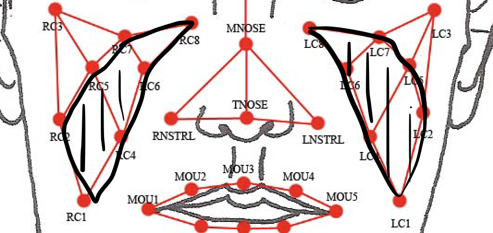
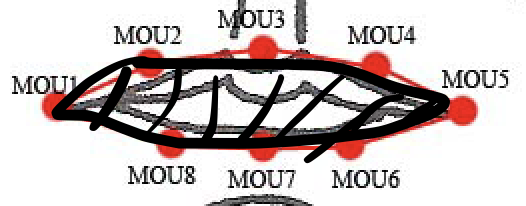

# Facial MoCap Data Selection

## Upper part:

1. max((max(RBRO) - min(RBRO)), (max(LBRO) - min(LBRO))): The vertical length of the eyebrow
2. Location of the RLID and the LLID: the eyelid movement
3. the time of the eyelid movement within 30 secs
4. The angle of the FH1-FH2-FH3: the forehead movement
5. The time of a full period of the FH1-FH2-FH3 angle changing 
6. the rate of change of the angle of the FH1-FH2-FH3: the speed of the forehead movement
7. max(the area of RBM0-RBM3, the area of LBM0-LBM3), min(the area of RBM0-RBM3, the area of LBM0-LBM3)
8. the average rate of change of the area from starting changing to almost not moving
9. max(length of RBRO1 to MH, length of LBRO1 to MH): may record the frowning movement

## Middle part:

1. The area of RC1, RC2, RC5, RC7, RC8, RC6, RC4 and the area of LC1, LC2, LC5, LC7, LC8, LC6, LC4: may represent the laugh level or the sorrow level

2. the average rate of change of the area from starting changing to almost not moving 
3. max(length of RC4 to RNSTRL, length of LC4 to LNSTRL)
4. max(length of RC4 to TNOSE, length of LC4 to TNOSE)
5. max(length of RC8 to MNOSE, length of LC8 to MNOSE)
6. max(length of RC3 to RC5, length of LC3 to LC5)
7. max(length of RC5 to RC4, length of LC5 to LC4)
8. the length of MH to MNOSE
9. the average rate of change of the **all above** length from starting changing to almost not moving
10. max(the angle of RC3-RC7-RC8, the angle of LC3-LC7-LC8)
11. the average rate of change of the angle from starting changing to almost not moving

## lower part:

1. the area of the MOU1~MOU8

   

2. the average rate of change of the area from starting changing to almost not moving

3. the time of the mouth area maintains its maximum 

4. min((MOU3 - MOU1), (MOU3 - MOU5))

5. length of MOU3 to MOU7

6. the average rate of change of the **all above** length from starting changing to almost not moving

7. The angle of CH1-CH2-CH3

8. the average rate of change of the angle from starting changing to almost not moving
